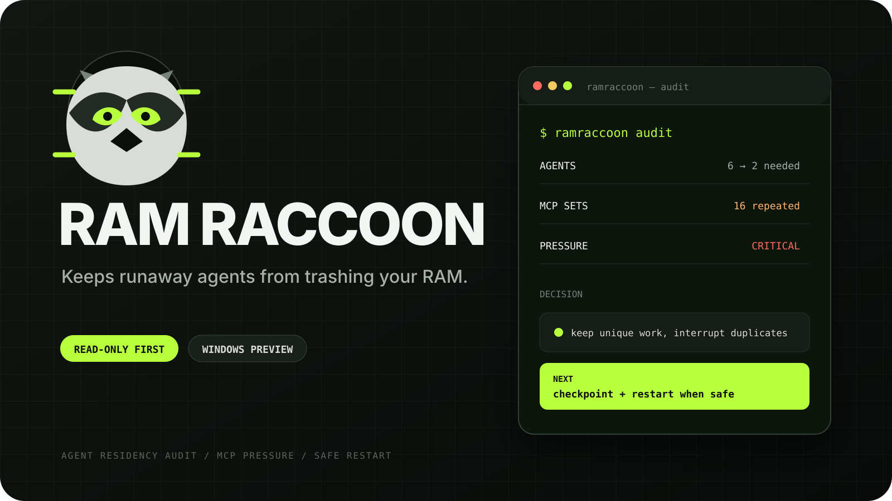

<p align="center">
  
</p>

<p align="center">
  <a href="./tests"></a>
  
  
  <a href="./LICENSE"></a>
</p>

<p align="center">
  <strong>The housekeeping skill for long-running AI coding sessions.</strong><br>
  It asks the question agent runtimes forget: <em>“Do I still need these agents running?”</em>
</p>

---

Long-running Codex sessions can retain child agents and complete MCP process stacks long after useful work finishes. RAM Raccoon audits the logical agent tree first, then measures the Windows process tree—without guessing which process is safe to kill.

## Quick start

```powershell
npx skills add krutftw/ramraccoon@ramraccoon -g -y
```

Then ask Codex:

```text
Use $ramraccoon to audit my agents and check memory pressure.
```

Or:

```text
Run housekeeping. Keep agents that still have unique work, interrupt obvious
duplicates, and tell me whether Codex needs a safe restart.
```

## What it does

| Layer | RAM Raccoon asks | Action |
|---|---|---|
| Child agents | Is there unfinished, unique work? | Keep, recommend interrupt, close when genuinely supported, or mark uncertain |
| Codex runtime | How many processes and repeated MCP markers exist? | Read-only Windows process-tree snapshot |
| System memory | Is physical/committed memory approaching exhaustion? | Healthy, elevated, high, or critical pressure |
| Recovery | Can work survive a restart? | Produce a concise resume checkpoint |

```text
RAM Raccoon: CRITICAL

Agents
├─ explorer       KEEP       unique task still running
├─ duplicate-scan INTERRUPT  result superseded
└─ verifier       UNCERTAIN  preserve until ownership is clear

Runtime
├─ Commit         98.8%
├─ Codex tree     345 processes / 17.2 GiB private
└─ MCP bundles    at least 16 repeated markers

Next
└─ checkpoint active work + restart Codex when safe
```

## The safety line

RAM Raccoon is deliberately conservative:

- It never interrupts the root/current agent.
- It never kills Windows processes.
- It never calls an old process “stale” based only on age or name.
- It never prints full process command lines.
- It does not pretend `interrupt_agent` releases MCP memory.
- It asks for a controlled restart when the app-server cannot unload itself.

This is a housekeeping layer, not an app-server patch.

## Run the Windows snapshot directly

```powershell
pwsh -NoProfile -File .\skills\ramraccoon\scripts\Get-RamRaccoonSnapshot.ps1 -Json
```

The script takes one bounded CIM process snapshot, locates top-level `codex.exe app-server` trees, aggregates private/working-set memory, detects common MCP families, and emits no process command lines.

## Evidence, not promises

A clean install from the public repository was discovered by Codex and executed
against a real long-running Windows session:

| Observed on 30 July 2026 | Result |
|---|---:|
| Windows commit | **96.3%** |
| Codex process tree | **387 processes** |
| Codex private memory | **25.27 GiB** |
| Repeated MCP bundle floor | **17** |
| Safety result | **0 processes terminated** |

That run correctly classified the machine as `CRITICAL` and recommended a safe
checkpoint and restart. It did **not** claim memory was reclaimed: the current
task had no child agents to interrupt, and no restart had been approved.

Read the complete [validation method](./docs/VALIDATION.md) and inspect the
[sanitized source snapshot](./evidence/windows-2026-07-30-before.json). The
[security assessment](./docs/SECURITY-ASSESSMENT.md) documents the source
review, attack-pattern scan, and install-time marketplace results.

Run the same live end-to-end check:

```powershell
pwsh -NoProfile -File .\tests\Test-RamRaccoonEndToEnd.ps1
```

## Why this exists

The behavior is tracked upstream in [openai/codex#25015](https://github.com/openai/codex/issues/25015): logical thread/subagent residency can remain coupled to eagerly started MCP runtimes, causing process and memory growth across long sessions.

RAM Raccoon provides a safe operator workflow while the lifecycle is fixed upstream.

## Status

**v0.2.0**

- [x] Main-session child-agent necessity audit
- [x] Read-only Windows Codex process snapshot
- [x] Commit/private-memory pressure levels
- [x] Repeated MCP bundle markers
- [x] Restart checkpoint contract
- [x] Before/after snapshot comparator
- [x] Reproducible public-install and live-runtime validation
- [ ] macOS and Linux inspectors
- [ ] App-server-native unload when a supported API exists
- [ ] Historical trend snapshots

## Contributing

Reproductions, process-family signatures, and safety improvements are welcome. Read [CONTRIBUTING.md](./CONTRIBUTING.md) and [SECURITY.md](./SECURITY.md) first.

RAM Raccoon is an independent community project and is not affiliated with or endorsed by OpenAI.

<p align="center">
  <sub>Keep the context. Release the runtime.</sub>
</p>
